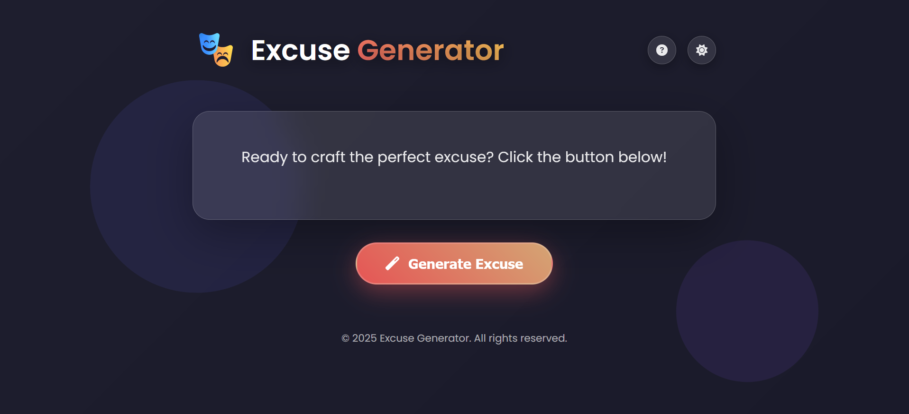

# 🎭 Random Excuse Generator

A simple and funny web app that generates random excuses when you didn’t finish your work, show up late, or skip a meeting.


---

## 📸 Screenshot


---

## 📂 Project Structure
- `index.html` → Main HTML file  
- `styles.css` → Styling  
- `script.js` → Logic for generating excuses  
- `excuses.json` → List of excuses  
- `images` → Store static assets

---

## 🛠 Built With
- HTML5  
- CSS3  
- JavaScript  

---

## 📖 How to Use
1. Clone the repository  
   ```bash
   git clone https://github.com/sanajitjana/excuse-generator.git
   ```

2. Open the Project in **VS Code** and install **Live Server** extension in VS Code.

3. Right-click `index.html` → **Open with Live Server**.

4. It will serve your project on http://127.0.0.1:5500/ (port may vary).

5. Open the URL in your browser and click **"Generate Excuse"** to see a random excuse.
   
---

## 🤝 How to Contribute

Contributions are welcome! 🎉

You can help improve this project in many ways — adding new excuses, fixing bugs, or enhancing features.

#### 📝 Steps to Contribute

1. **Fork the Repository**
   
    Click the **Fork** button (top right of the repo page) to create your own copy.

2. **Clone Your Fork**
   
    ```bash
    git clone https://github.com/<your-username>/excuse-generator.git
    cd excuse-generator
    ```

3. **Create a New Branch**
   
   Use a meaningful branch name related to your contribution.

   ```bash
   git checkout -b feat/add-new-excuse
   ```

4. **Make Your Changes**
   
- Add new excuses inside `excuses.json`
- Or update HTML/CSS/JS for improvements
- Make sure everything works by running it with Live Server

5. **Commit Your Changes**
   
    Write a clear commit message:

    ```bash
    git add .
    git commit -m "feat: added a new funny excuse"
    ```


6. **Push to Your Fork**
   
    ```bash   
    git push origin feat/add-new-excuse
    ```


7. **Open a Pull Request (PR)**

- Go to the original repository

- Click **Compare & Pull Request**

- Add a short description of your changes

---

## 📜 License

This project is licensed under the MIT License.

---

## 🙌 Contributors

Thanks to all the amazing contributors!

<a href="https://github.com/sanajitjana/excuse-generator/graphs/contributors">  </a>


## ⭐ Support

If you like this project, please give it a ⭐ on GitHub — it helps more people discover it!